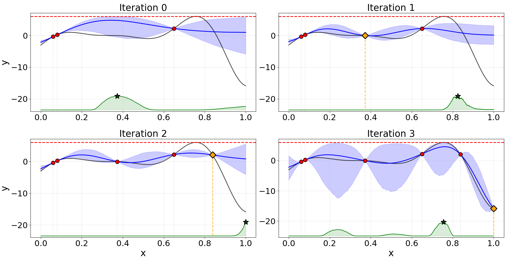

# TGQP-BO: Bayesian Optimization for Known-Bound Functions

> Implementation of the M.Sc. Thesis: *"Bayesian Optimization for Known-Bound Functions via Truncated Gaussian Quasi-Processes"*  
> **Author:** Amit Levin  

---

## Overview

Standard Gaussian Processes (GPs) are the default surrogate model in Bayesian Optimization, but they implicitly assume an unconstrained target space. In many real-world optimization problems, the objective function has a known maximum — a global bound that standard GP-based BO ignores entirely.

This project introduces **TGQP-BO**, a Bayesian Optimization framework built on a novel surrogate model: the **Truncated Gaussian Quasi-Process (TGQP)**. TGQPs extend GPs to handle known global bounds by truncating the joint Gaussian distribution to a convex constraint set. Due to the probabilistic nature of a truncated space, TGQPs are defined only on a fixed set of evaluation locations — a formulation known as **transductive inference**.

The framework demonstrates improved sample efficiency in Bayesian Optimization when the objective function's maximum is known — not only compared to standard unconstrained GP-based BO, but also compared to methods specifically designed for known-bound settings, including approaches that incorporate the bound directly into the surrogate via a GP transformation, or into the acquisition function design.

---

## TGQP-BO



*4 consecutive optimization iterations on the "Forrester" function (black) given the known global maximum*

---

## Key Contributions

- **Truncated Gaussian Quasi-Process (TGQP)** — a principled surrogate model for black-box functions with known global bounds, formalized as a transductive model on fixed evaluation grids
- **Fully Bayesian Inference** via a block MCMC scheme combining:
  - **Exact Hamiltonian Monte Carlo (HMC)** for sampling constrained latent vectors, implemented via the R package `hdtg`
  - **Double Metropolis-Hastings (DMH)** updates for hyperparameter inference, addressing doubly-intractable normalizing constants
- **Convexity-preserving finite-dimensional interpolation** for scalable inference while maintaining global constraints throughout
- **BO integration** — experiments show that pairing the TGQP surrogate with the Max-value Entropy Search (MES) acquisition function yields the best performance

> **Note on runtime:** Due to the DMH inference step, fitting the TGQP model is slower than traditional MLE-based methods. However, the runtime remains negligible relative to the cost of evaluating the black-box objective — which is precisely the setting this framework is designed for.

---

## Project Structure

```
tgqp_bo/
│
├── known_opt_gp/                        # Core TGQP surrogate model package
│   ├── truncated_gp.py                  # BoundedGP / TGQP class (main model)
│   ├── harmonic_hmc.py                  # HMC sampler interface via rpy2
│   ├── epm.py                           # Expectation-Propagation utilities
│   └── __init__.py
│
├── known_opt_bo/                        # Bayesian Optimization framework package
│   ├── bo.py                            # BOKnownOpt — main BO loop
│   ├── bo_viz.py                        # Visualization utilities
│   ├── run_bo.py                        # BO runner / entry point
│   ├── acquisition/
│   │   ├── acq_functions.py             # Acquisition functions
│   │   └── __init__.py
│   ├── test_functions/
│   │   ├── functions.py                 # 1D benchmark test functions
│   │   └── __init__.py
│   ├── experiments/                     # Experiment scripts and results
│   │   ├── run_test_functions_exp.py
│   │   ├── compare_u_exp.py
│   │   └── exp_analysis.py
│   └── __init__.py
│
├── requirements.txt
└── README.md
```

---

## Installation

### Step 1 — Prerequisites (R + hdtg)

The TGQP inference engine uses Harmonic Monte Carlo sampling implemented in R, accessed from Python via `rpy2`. You must install R and the `hdtg` package before installing the Python dependencies.

**1. Install R 4.4.3**  
Download from: https://cran.r-project.org/bin/windows/base/old/4.4.3/

**2. Install Rtools (Windows only)**  
Required to compile R packages with C++ components:  
https://cran.r-project.org/bin/windows/Rtools/

**3. Install the `hdtg` R package (version 0.2.1)**  
Run the following in your terminal:
```bash
Rscript -e "install.packages('https://cran.r-project.org/src/contrib/Archive/hdtg/hdtg_0.2.1.tar.gz', repos=NULL, type='source')"
```

### Step 2 — Python Environment

```bash
# Clone the repository
git clone https://github.com/Amitle51/tgqp_bo
cd tgqp_bo

# Create a virtual environment (recommended)
python -m venv venv
venv\Scripts\activate

# Install Python dependencies
pip install -r requirements.txt
```

> **Python version:** 3.10.19

---

## Reproducing the Experiments

The experiment scripts in `known_opt_bo/experiments/` compare TGQP-BO against baseline BO methods. To reproduce the experiments, you will additionally need the **BABO** framework set as a source root in your project.

**BABO** is an open-source Bayesian Optimization benchmarking framework available at:  
https://github.com/HanyangHenry-Wang/BABO

Clone BABO and add it as a source root in your IDE (or add it to your `PYTHONPATH`) before running the experiment scripts.

---

## Scope

This implementation focuses on **1D black-box optimization problems with a known maximum**. While fully functional and experimentally validated in this setting, the framework is also designed with extensibility in mind — it can be viewed as a foundation for higher-dimensional problems, where the core ideas of constraint-aware surrogate modeling and transductive inference remain applicable.

---

## Citation

This repository is the implementation of an M.Sc. thesis submitted in 2025. If you use this code or build upon this work, please cite accordingly once the thesis is published.

```
Amit Levin, "Bayesian Optimization for Known-Bound Functions via Truncated Gaussian Quasi-Processes", M.Sc. Thesis, 2025.
```

---

## License

This project is released for academic and research purposes. Please contact the author for other use cases.
